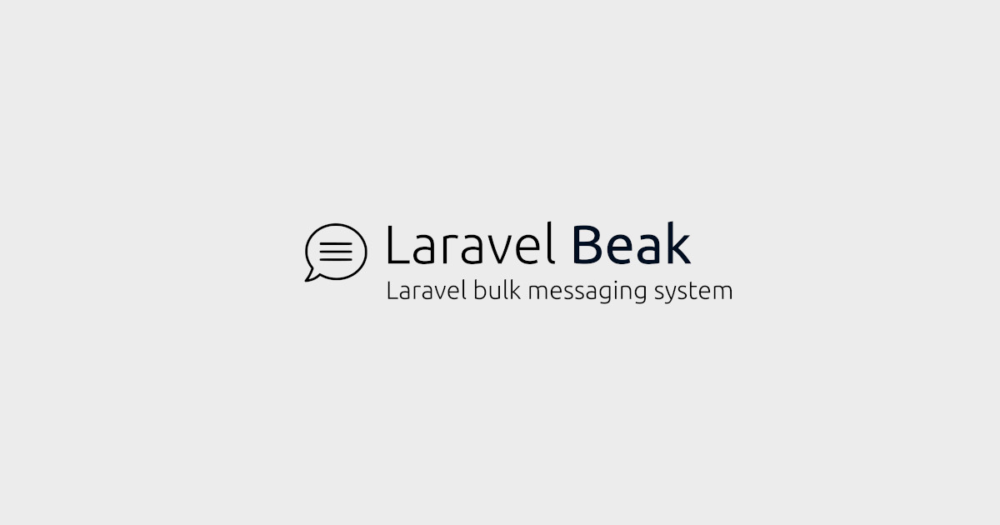

<div align="center">
	<p></p>   
    <a href="#requirements">Requirements</a> |    
    <a href="#installation">Installation</a> |    
    <a href="#how-to-send-a-message">How to send a message</a> |    
    <a href="#how-to-get-a-delivery-report">How to get a delivery report</a>
</div>

------

# Laravel Beak bulk sms messaging system

## Introduction

This project implements all the necessary functionality for sending single or multiple messages, as well as retrieving the reports eg. message status, account balance etc. a developer will need. 

This project was built exclusively for the [Laravel](https://laravel.com) platform.

At the moment, this project operates using smscanal.com bulk sms provider but there is an interface built that can help you develop additional modules for other providers as well.

## Requirements

- PHP >= 8.0
- Laravel >= 8.6.6

## Installation

Installation is pretty easy. 

First you install the package

```bash
composer require jorgenwdm/laravel-beak
```

Then you can publish the configuration file of this package. 

```php
php artisan vendor:publish --provider="Jorgenwdm\Beak\BeakServiceProvider"
```
Note: Our configuration file is `laravel-beak.php` and you will find it in your Laravel `config` folder.

Inside the configuration file `laravel-beak.php`, you can fill the appropriate lines with the the credentials given to you by your provider. For example:

```php
    /*
    |--------------------------------------------------------------------------
    | Settings for provider Canal (smscanal.com)
    |--------------------------------------------------------------------------
    | 
    | Here we define the credentials given to us by the provider
    | Note: Keep in mind that you can use the respective env keys in capitals in your .env file
    |
    */
    
    'canal_api_url' => env('BEAK_CANAL_API_URL', 'http://messaging.smscanal.com/sms'),
    'canal_api_user' => env('BEAK_CANAL_API_USER', ''),
    'canal_api_password' => env('BEAK_CANAL_API_PASSWORD', ''),
    'canal_api_sender' => env('BEAK_CANAL_API_SENDER', ''),    
```

And we are ready to go!

## How to send a message

The way to send an sms is quite simple. You initialize the service you want eg. CanalSmsMessage, fill it with the parameters
from, to, text and trigger the sending process.

We can use three formatting methods: `from()`, `to()`, `text()` in order to compose our message.

And then we can use `send()` to trigger the sending proccess.

```php    
    use Jorgenwdm\Beak\Messengers\CanalSmsMessage;

    $message = new CanalSmsMessage();
    $message->from('DEMOSENDER')->to('306942931111')->text("HELLO WORLD")->send();

```

Important note: Some sms providers don't want the + sign before the international phone number.

The sending process returns an object that we call response object. 

Some important methods and properties that the response object has are: `hasException`, `getJson()`, `getException()`, `getRaw()`

```php    
    use Jorgenwdm\Beak\Messengers\CanalSmsMessage;

    $message = new CanalSmsMessage();
    $result = $message->from('DEMOSENDER')->to('306942931111')->text("HELLO WORLD")->send();
        
    if( !$result->hasException ) 
    {
        
        // we read the data of the result as a json object
        $json = $result->getJson();   
        
        // now based on the documentation of the provider, we present our results
        if( !isset($json->error) )
            echo 'Your message was sent to ' . $json->sms->{'mobile-no'};
        else             
            echo 'Your message was not sent. API returned error: ' . $json->error->{'error-description'};                   
    
    }    
    else
    {
        
        // inform the user about the exception
        echo 'An exception happened: ' . $result->getException()->getMessage();        

    }        
```

## How to get a delivery report

The way to retrieve a delivery report is quite simple and resembles a lot to the message sending process.

You initialize the service you want eg. CanalSmsReport, fill it with the parameters `for` and then trigger the delivery report request process.


```php    
    use \Jorgenwdm\Beak\Reporters\CanalSmsReport;

    $report = new CanalSmsReport();
    $result = $report->for(["825252128"])->request();
   
    if(!$result->hasException) 
    {  
    
        // we read the data of the result as a json object
        $json = $result->getJson();   

        // now based on the documentation of the provider, we present our results
        echo "Report Code: " . $json->responsecode . "<br/>";
        echo "Report Description: " . $json->resposedescription . "<br/>";
            
    }
    else
    {

         // inform the user about the exception
        echo 'An exception happened: ' . $result->getException()->getMessage();        

    } 
```

## License

This project is open-sourced software licensed under the [MIT license](https://opensource.org/licenses/MIT).
